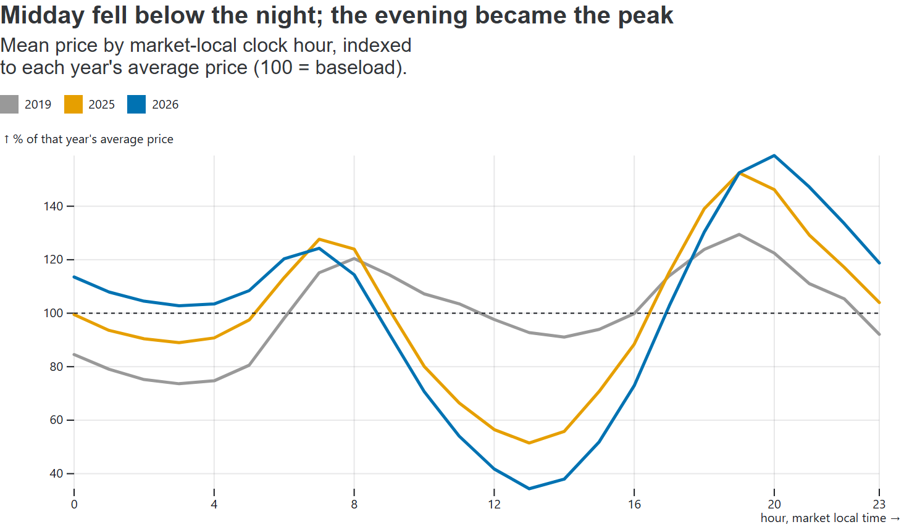

# German Power Market Research

Day-ahead price shape, forecasting and battery arbitrage in Germany–Luxembourg (DE-LU), 2019–2026.

**[Read the research note](https://pedrods20.github.io/german-power-research/)** · [Forecast](https://pedrods20.github.io/german-power-research/forecast) · [Storage](https://pedrods20.github.io/german-power-research/battery) · [Methodology](https://pedrods20.github.io/german-power-research/methodology)



## Bottom line

Solar has turned the German day into a midday trough between two peaks. That recurring shape, not the forecast, carries most of a battery's day-ahead value; a price forecast earns on the days the shape breaks.

## Key findings

1. **A simple rule captures most of the value.** Repeating the last similar day captured 81% of the perfect-foresight margin in 2020 and 93% in 2026 to date (1 MW / 4 MWh, one cycle a day).
2. **The forecast earns on atypical days.** A per-hour Ridge forecast cuts hourly MAE by 24.3% against the best naive forecast, worth about €4,400/MW a year. The most atypical fifth of days carries 77% of that gain; on the most typical 40% the model loses.
3. **Where it will earn is visible at the gate.** The fifth of days on which the forecast disagrees most with the simple rule carries 64% of its gain. Trading the forecast only on those days adds nothing, because the model already follows the shape when the two agree.
4. **Solar has inverted the block spread.** The on-peak premium moved from +€10.6 to −€13.7/MWh while the daily high–low range rose from 80% to 146% of the average price. Solar's capture rate fell from 93% to 51% (2019 to 2026 to date).
5. **Balancing pays more per MW but cannot absorb the fleet.** aFRR capacity averaged €649/MW/day and FCR €407, against €294 for day-ahead arbitrage (November 2020 to September 2026). Germany procures about 0.6 GW of FCR and 2 GW of aFRR each way against 21 GW of installed batteries, and arbitrage rose from 34% to 74% of the aFRR value between 2021 and 2026.
6. **Quarter-hour products add 4–9%** to the arbitrage ceiling, most for 1-hour batteries.

Forecast-based dispatch underperformed its strongest naive comparator on 827 of 2,404 days. Battery figures are simulated day-ahead margins before operating, degradation and capital costs, not revenue estimates for a real asset.

## Method

- Data: Energy-Charts (Fraunhofer ISE), which republishes ENTSO-E and SMARD figures, and German balancing auction results from regelleistung.net, versioned in the repository.
- Forecast: walk-forward from 2020, using only information public at the 12:00 D-1 gate, scored against LightGBM and three naive benchmarks. Published figures come from a frozen, content-addressed release that CI checks on every build.
- Battery: dynamic-programming dispatch on the forecast, settled at realised prices; 1 MW at 1, 2 and 4 MWh, 90% round trip.
- Prospective pilot: since 23 September 2026 a scheduled job issues the forecast and the three naive comparators before each gate and archives the inputs each one used.
- Stack: Python (Polars, NumPy, LightGBM), Observable Framework, GitHub Actions.

## Scope

Results are retrospective, on history inspected during development; the prospective pilot is reported separately. The study is zonal and covers the day-ahead auction and FCR and aFRR capacity. Continuous intraday, activation energy and imbalance settlement are out of scope for want of free public data. Market data runs to 15 September 2026 and the forecast evaluation from 3 January 2020 to 12 September 2026; 2026 figures are year to date.

## Author

Pedro Cabral, power market analyst covering Brazil, Chile and Argentina. This independent project applies the same work on fundamentals and price formation to the German market. [GitHub](https://github.com/Pedrods20)

<details>
<summary>Reproduce</summary>

```bash
python -m venv .venv
source .venv/bin/activate        # Windows: .venv\Scripts\Activate.ps1
pip install -e ".[dev]"
gpa validate
gpa balancing                    # FCR and aFRR results; slow on the first run
gpa quarter-hour-study
gpa export
npm ci
npm run build
```

The repository holds the versioned data and the frozen forecast release; `gpa export --check` confirms the site tables match them. Definitions and assumptions are in the [methodology](https://pedrods20.github.io/german-power-research/methodology).

</details>

Code: [MIT](LICENSE). Data remains subject to provider terms.
